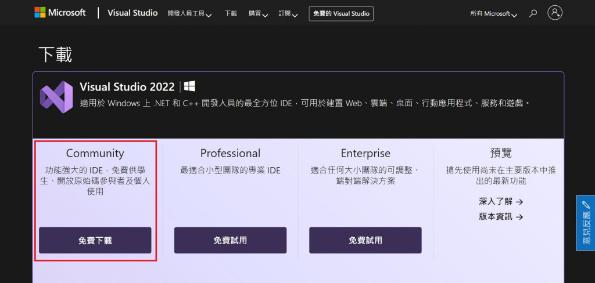
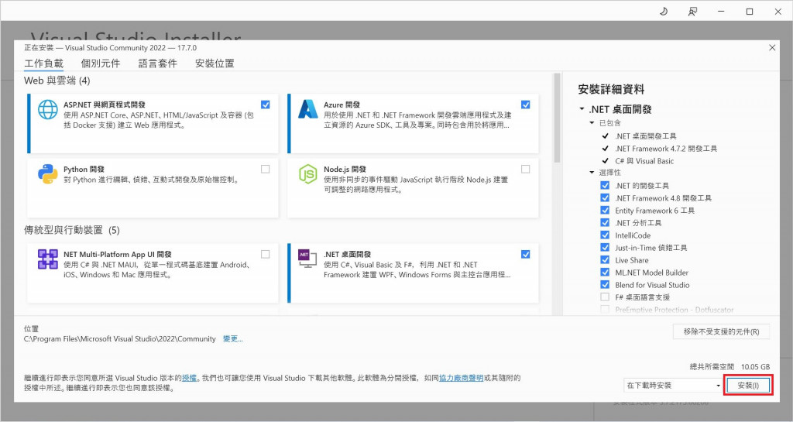
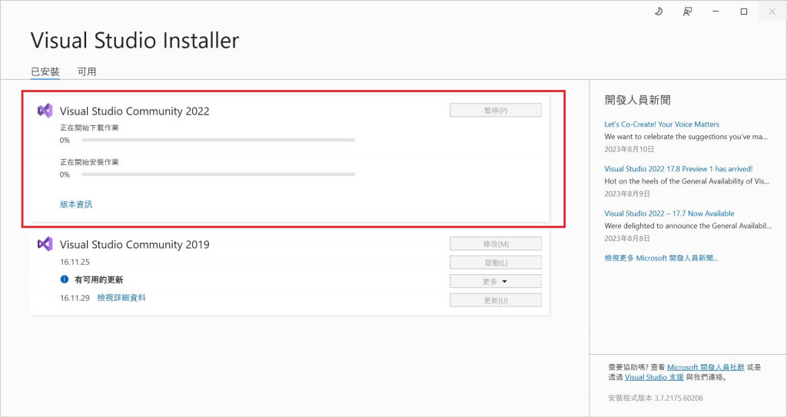
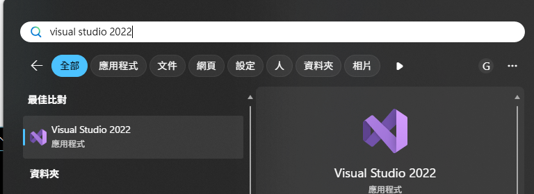
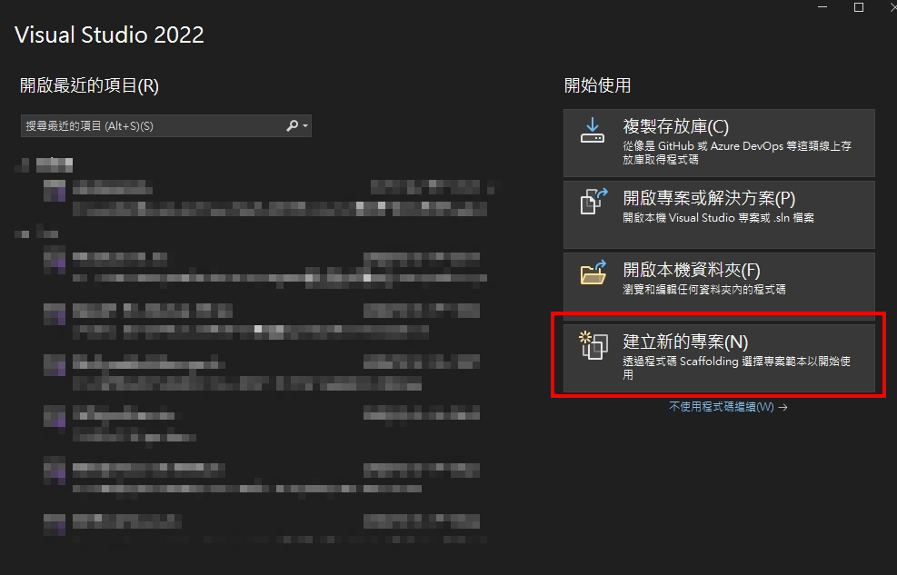
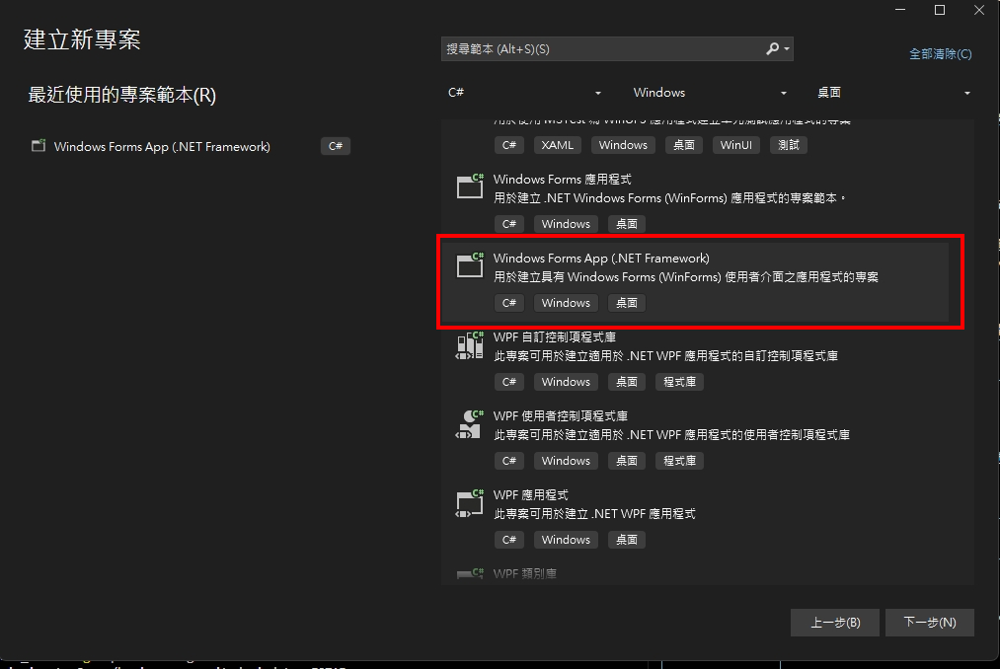
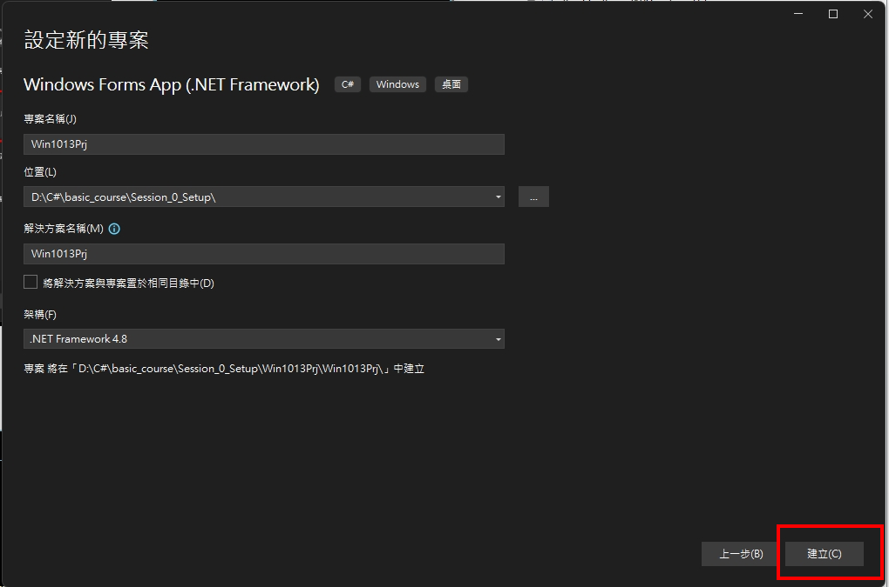
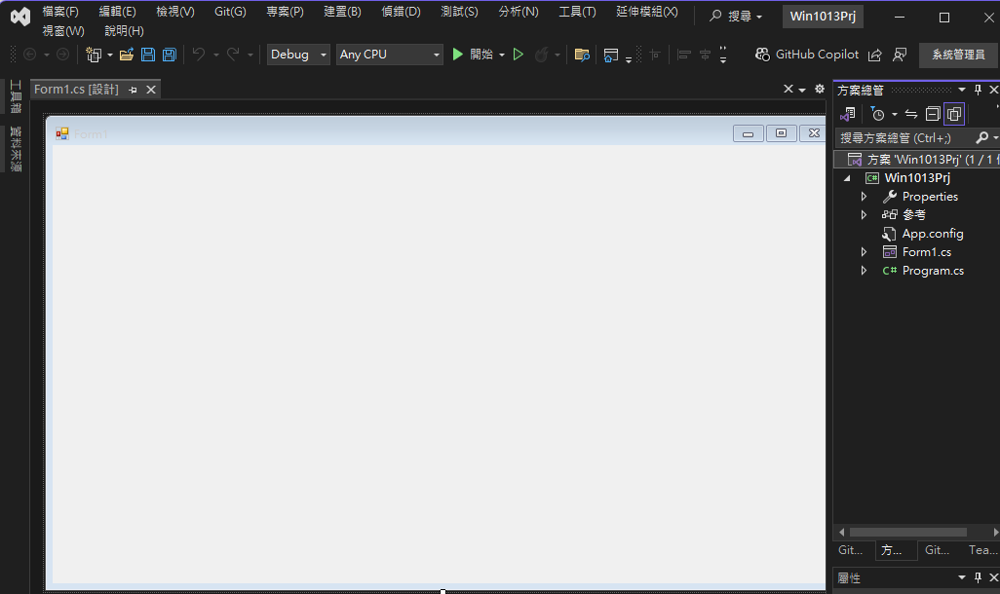

# 第一堂課：安裝 Visual Studio 2022 Community

---

## 🎯 課程目標

- 學會安裝 Visual Studio 2022 Community 版
- 為後續 C# 開發做好準備

---

## 📝 安裝步驟

### 1️⃣ 下載安裝程式

1. 前往 [Visual Studio 官方下載頁面](https://visualstudio.microsoft.com/zh-hant/vs/community/)
2. 點選「免費下載」取得安裝程式

   

### 2️⃣ 執行安裝程式

1. 開啟剛剛下載的安裝程式（通常檔名為 `vs_Community.exe`）
2. 若出現安全性提示，請選擇「是」允許安裝

### 3️⃣ 選擇工作負載

1. 可依需求選擇其他工作負載（如 ASP.NET、.NET 桌面開發等）

   

| 工作負載名稱       | 說明                  |
| ------------------ | --------------------- |
| .NET 桌面開發      | 必選，C# Windows 開發 |
| ASP.NET 與網頁開發 | 選用，Web 開發        |

### 4️⃣ 開始安裝

1. 點選右下角「安裝」按鈕
2. 等待安裝完成，過程可能需數分鐘

   

### 5️⃣ 啟動 Visual Studio

1. 安裝完成後，點選「啟動」或在開始選單搜尋「Visual Studio 2022」
2. 首次啟動時可選擇登入 Microsoft 帳號（可略過）

   

### 6️⃣ [變更語言](https://dog0416.blogspot.com/2021/07/visual-studio-2022.html#google_vignette)

### 7️⃣ 確認安裝

1. 開啟 Visual Studio 後，選擇「建立新專案」
2. 選擇「Windows Forms 應用程式」或「主控台應用程式」測試是否可正常建立專案

   

   

   

   

---

> 如有安裝問題，請截圖並詢問老師協助
