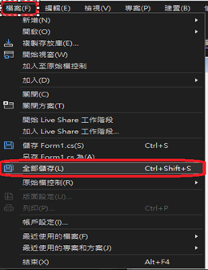

# C# 單元一：HelloWorld

---

## 🎯 單元目標

1. 學員能在指定目錄下新增方案／專案。
2. 使用工具箱在表單上新增三個常用物件：TextBox、RadioButton、Button（分別為文字輸入框、單選按鈕、命令確認按鈕）。
3. 按下 Button（命令確認按鈕）時，根據選擇顯示不同訊息。
4. 產生專案的 .exe 檔，佈署到指定目錄。
5. 結束專案。
6. 開啟舊專案。

---

## 📝 課程步驟

### 1️⃣ 建立課程資料夾

1. 於 `C:\` 或 `D:\` 根目錄下新增資料夾 `C#Exercise`。
2. 在 `C#Exercise` 新增目錄 `Session_1_HelloWorld`。

   

---

### 2️⃣ 開啟 Visual Studio 2022 並建立專案

1. 開啟 Visual Studio 2022。
2. 點選「建立新的專案」。

   
3. 選擇上方三個選單：`C#`、`Windows`、`桌面`。
4. 選擇 `Windows Forms App (.NET Framework)`。

   
5. 專案名稱：`Session1_HelloWorld`
6. 位置：`D:\C#Exercise\Session_1_HelloWorld\`（選擇步驟一建立的目錄）

   

---

### 3️⃣ 常用功能介紹

- **方案總管**：檢視 → 方案總管
- **工具箱**：檢視 → 工具箱
- **屬性視窗**：檢視 → 屬性視窗

  

---

### 4️⃣ 將控制項拉至畫面

1. 開啟工具箱 → 通用控制項。
2. 拉取以下控制項至表單：

   - 1 個 TextBox
   - 2 個 RadioButton
   - 1 個 Button

   

---

### 5️⃣ 更改控制項屬性

| 控制項      | Name         | Text                              | Font             |
| ----------- | ------------ | --------------------------------- | ---------------- |
| TextBox     | textBox1     | 請點選單radioButton並按一下Button | 標楷體, 粗體, 14 |
| RadioButton | radioButton1 | Hello World!                      | 標楷體, 粗體, 14 |
| RadioButton | radioButton2 | Good Bye!                         | 標楷體, 粗體, 14 |
| Button      | button1      | 確認                              | 標楷體, 粗體, 14 |

   

---

### 6️⃣ 存檔並重新開啟專案

- 快捷鍵：`Ctrl+Shift+S`
- 路徑：檔案 → 全部儲存

  

#### 重新開啟專案方法

1. 直接點選資料夾內副檔名 `.sln` 的方案檔。

   
2. 開啟 Visual Studio 2022，選擇「開啟專案或解決方案」，選擇 `.sln` 檔。

   
3. 開啟 Visual Studio 2022，點選「檔案 → 開啟 → 專案/方案」，選擇 `.sln` 檔。

   

   

---

### 7️⃣ 點擊按鈕秀出對應訊息

- 在 Button 的 Click 事件中，判斷哪個 RadioButton 被選取，並顯示對應訊息。

  

  
