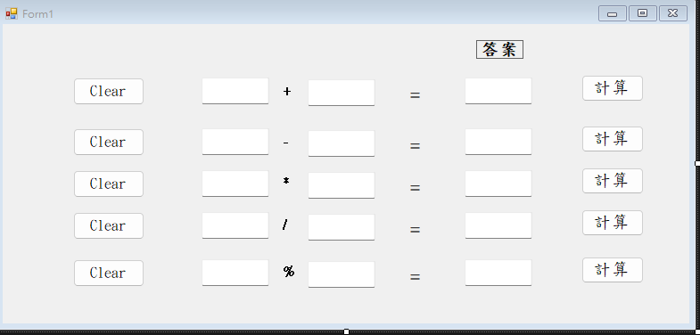

# 🚂 C#單元二：Operator

---

## 🎯 單元目標

- 了解 C# 運算子
- 實現基本數學運算
- 熟悉常見運算用法

---

## 🧮 常用運算子一覽

| 運算子 Operator |          名稱 Name          | 描述 Description | 範例 Example |
| :-------------: | :-------------------------: | :--------------: | :----------: |
|        +        |    加法 `<br>`Addition    |      X + Y      |    X + Y    |
|        -        |  減法 `<br>`Subtraction  |      X - Y      |    X - Y    |
|        *        | 乘法 `<br>`Multiplication |      X * Y      |    X * Y    |
|        /        |    除法 `<br>`Division    |      X / Y      |    X / Y    |
|        %        |   取餘數 `<br>`Modulus   |      X % Y      |    X % Y    |
|       ++       |   遞增 `<br>`Increment   |    數值遞增+1    |     X++     |
|       --       |   遞減 `<br>`Decrement   |    數值遞減-1    |     X--     |

---

## 🔗 複合運算子

| 運算子 Operator | 範例 Example | 等同 Same As |
| :-------------: | :----------: | :----------: |
|       +=       |    X += 8    |  X = X + 8  |
|       -=       |    X -= 8    |  X = X - 8  |
|       *=       |    X *= 8    |  X = X * 8  |
|       /=       |    X /= 8    |  X = X / 8  |
|       %=       |    X %= 8    |  X = X % 8  |
|        =        |    X = 5    |              |
|        >        |    X > 5    |              |
|        <        |    X < 5    |              |

---

## 🔹 INT基本介紹

| 型別                      | 位元數 (bit) | 位元組 (byte) | 範圍             | 會佔的記憶體              |
| ------------------------- | ------------ | ------------- | ---------------- | ------------------------- |
| **Int16 / short**   | 16           | 2             | -32,768 ~ 32,767 | 每個值佔**2 bytes** |
| **UInt16 / ushort** | 16           | 2             | 0 ~ 65,535       | 每個值佔**2 bytes** |
| **Int32 / int**     | 32           | 4             | 約 -21億 ~ +21億 | 每個值佔**4 bytes** |
| **UInt32 / uint**   | 32           | 4             | 0 ~ 42億         | 每個值佔**4 bytes** |
| **Int64 / long**    | 64           | 8             | 約 ±9×10¹⁸   | 每個值佔**8 bytes** |
| **UInt64 / ulong**  | 64           | 8             | 0 ~ 1.8×10¹⁹  | 每個值佔**8 bytes** |

---

# 🧩 C# `try-catch` 錯誤處理教學

## 🔹 什麼是 `try-catch`

在 C# 中，`try-catch` 用來**處理執行期間的例外狀況 (Exception)**。
這樣即使程式發生錯誤，也不會中斷執行，能讓你優雅地應對錯誤。

---

## 🔸 基本語法

```csharp
try
{
    // 嘗試執行可能會發生錯誤的程式碼
}
catch (Exception ex)
{
    // 當錯誤發生時執行這裡
    //Console.WriteLine("錯誤訊息：" + ex.Message);
    MessageBox.Show(ex.Message);
}
```

##  Leave 事件介紹：
```
if (txtAdd2.Text.Trim() !="")
{
    int iAdd2;
    if (int.TryParse(txtAdd2.Text, out iAdd2))
    {
        //doNothing
    }
    else
    {
        MessageBox.Show("你輸入的資料不是數字喔");
        txtAdd2.Text = "";
        txtAdd2.Focus();
    }
}
```
---

## 🏠 回家作業：完成 乘法 除法 程式 如果有空 可以多做 取餘數

條件如下 
1.建立計算按鈕 請利用Convet.ToInt16轉換控制項目(TextBox)
2.並且在建立按鈕Clear達到對應清除控制項效果
3.在控制項1&2 使用Leave事件 判斷輸入資料是否為數字，如果不是數字請清空該控制項並且Focus到該控制項

完成畫面如下
